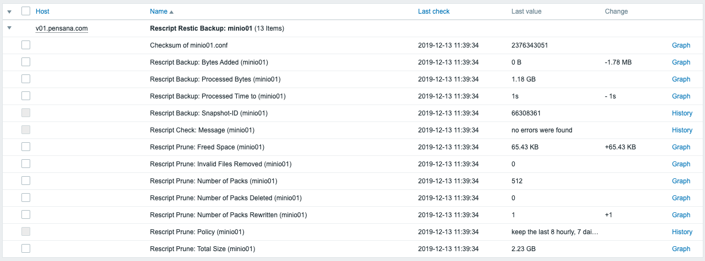
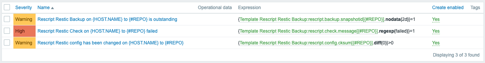

# Zabbix Template: Rescript Restic Backup

This script logs [restic backup](https://restic.net/) tasks to Zabbix, when using the [rescript wrapper](https://gitlab.com/sulfuror/rescript.sh). It's capable of logging various output values of backup, check and forget & prune tasks.

## Screenshots
### Latest Data


### Triggers


## Requirements
* Restic
* Rescript
* Zabbix-Sender
* python3
* python3-pip
* python3: humanfriendly

## How to Use

1. Download **log-rescript.sh** and **rescript-repo-discovery.pl** to `/etc/zabbix/scripts/`

  ```bash
  mkdir -p /etc/zabbix/scripts
  cd /etc/zabbix/scripts
  curl -O https://raw.githubusercontent.com/sebastian13/zabbix-templates/master/rescript-restic-backup/scripts/log-rescript.sh
  curl -O https://raw.githubusercontent.com/sebastian13/zabbix-templates/master/rescript-restic-backup/scripts/rescript-repo-discovery.pl
  chmod +x log-rescript.sh rescript-repo-discovery.pl
  ``` 

2. Upload the template **zbx\_template\_rescript-backup** to Zabbix Server and assign it to a host

3. Run the script after each **rescript** call

### Examples
- As simple as

	```bash
	rescript reponame && /etc/zabbix/scripts/log-rescript.sh
	```

- Running as cronjob, I'm reccomending using [chronic from moreutils](http://manpages.ubuntu.com/manpages/xenial/man1/chronic.1.html)

	```bash
	26 3 * * * chronic rescript reponame && chronic /etc/zabbix/scripts/log-rescript.sh
	```

- Within a script

	```bash
	#!/bin/bash
	
	set -e
	
	# Rescript's automatic function (https://gitlab.com/sulfuror/rescript.sh/wikis/usage)
	# reads the "LOGGING" variable. By default, the "LOGGING" variable is set to "yes".
	# This will create a log file with the output, which is necessary for this script.
	rescript example.repo.1
	# Run this script after each "rescript ..." call.
	source /etc/zabbix/scripts/log-rescript.sh
	
	# If using a rescript command, you have to use the logging flag -l or --log
	# to create a logfile, which is necessary fort his script.
	# -l, --log: create log file with command output.
	rescript example.repo.2 backup -l
	source /etc/zabbix/scripts/log-rescript.sh
	
	# This script will also log the output of a restic check.
	# -C, --check: check for errors in repository
	rescript example.repo.2 backup -lC
	source /etc/zabbix/scripts/log-rescript.sh
	
	```

## Rescript LVM Backup Monitoring

This template also enables monitoring of LVM backups via restic and rescript. Take a look at the [lvm-restic-backup script](https://github.com/sebastian13/lvm-restic-backup) for detailed instructions.
