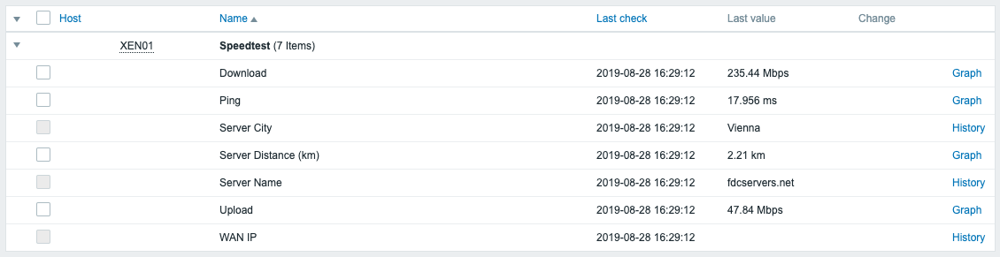
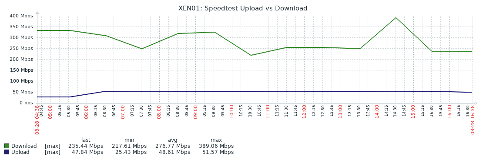

# Zabbix Template: Speedtest

Monitoring internet bandwith using speedtest and zabbix. The script uses `zabbix_sender` to send the values to a Zabbix Server. The interval is set via cron. To get different results the script will randomly choose one of the 10 closest servers each runtime.

Inspired by

- https://git.cdp.li/polcape/zabbix/tree/master/zabbix-speedtest
- https://github.com/sk3pp3r/speedtest2zabbix

## Screenshots
### Gathered Data


### Graphs



## How to Use

1. Install [Speedtest-Cli](https://github.com/sivel/speedtest-cli)

 ```bash
curl -Lo /usr/bin/speedtest-cli 
chmod +x /usr/bin/speedtest-cli
```

1. Download `speedtest-zabbix.sh`

 ```bash
mkdir -p /etc/zabbix/scripts
cd /etc/zabbix/scripts
curl -Lo 
```

1. Create Cron

 ```bash
curl -Lo /etc/cron.d/speedtest-zabbix
service cron reload
```

1. Import the Template `zbx_template_speedtest.xml` to Zabbix and assign in to a server.
 https://raw.githubusercontent.com/sebastian13/zabbix-templates/master/restic-backup/zbx_template_restic-backup.xml

### Additional Resources

- [Manpage: Zabbix Sender](https://www.zabbix.com/documentation/current/manpages/zabbix_sender)
- [Usage: Speedtest-CLI](https://github.com/sivel/speedtest-cli)